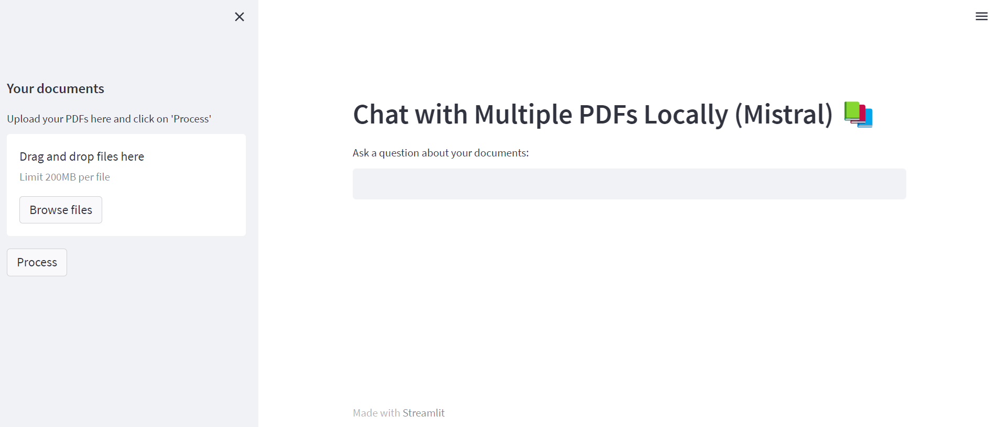

# This respootary is an implemntation for an offline Retrieval-Augmented Generation (RAG) model
This model based on differnt technologies, softwares and platforms; Mainly: 
1-Ollama: https://ollama.com/
2- Langchain, 
3- Mistral:
4- FAISS: 
5- Streamline: 

## Main Model Description:

This model utilizes the Ollama software tool to run large language models (LLMs) locally on a computer, enabling offline language processing tasks. Ollama provides access to a diverse set of pre-trained LLM models.
Langchain complements Ollama by acting as a framework. It allows developers to integrate these locally-run LLMs into applications. 
This makes the LLMs easier to use and build upon. Langchain goes a step further by enabling the development of RAG systems. These systems use various tools to process information, 
allowing for more refined and informative responses from the language model.

## Using the RAG:  
1- Insall Ollama "https://ollama.com/download" 
2- Cloning:  
3- Running:
4- The server will open the application as shown on the picture. You can use your pdf documents, or you can use the two documents provided on the example folder. 
The Example folder contains two pdf documents genertaed by ChatGPT include information about the dams.  

## Main Functions explanination: 
The image illustrates the overall steps of the model. It begins with uploading multiple PDF files, followed by processing them before engaging in conversation, as outlined below: 
1. Call the `get_pdf_text(pdf_docs)` function to read and concatenate text from each page of the uploaded PDF documents. 
    - **Main method for parsing:** PyPDF2 library. 
    - **Output:** raw_text

2. Call the `get_text_chunks(raw_text)` function to split the extracted text into manageable chunks. 
    - **Main method:** langchain library. 
    - **CharacterTextSplitter Parameters:** chunk size: 1000 characters, overlap: 200 characters. 
    - **Output:** text_chunks

3. Call the `get_vectorstore(text_chunks)` function to generate embeddings for the text chunks and store them in a vector database. 
    - **Main method:** 
        - **Embeddings:** [HuggingFace Instructor-XL](https://huggingface.co/hkunlp/instructor-xl)
        - **FAISS:** A library for efficient similarity search. [More info](https://engineering.fb.com/2017/03/29/data-infrastructure/faiss-a-library-for-efficient-similarity-search/)
    - **Convert the embeddings vectorspace to txt file (embeddings.txt)**

4. Call the `get_conversation_chain(vectorstore)` function to create a conversational chain with the generated vectorstore. 
    - **This operation relies on the langchain library for creating conversational chains.**

